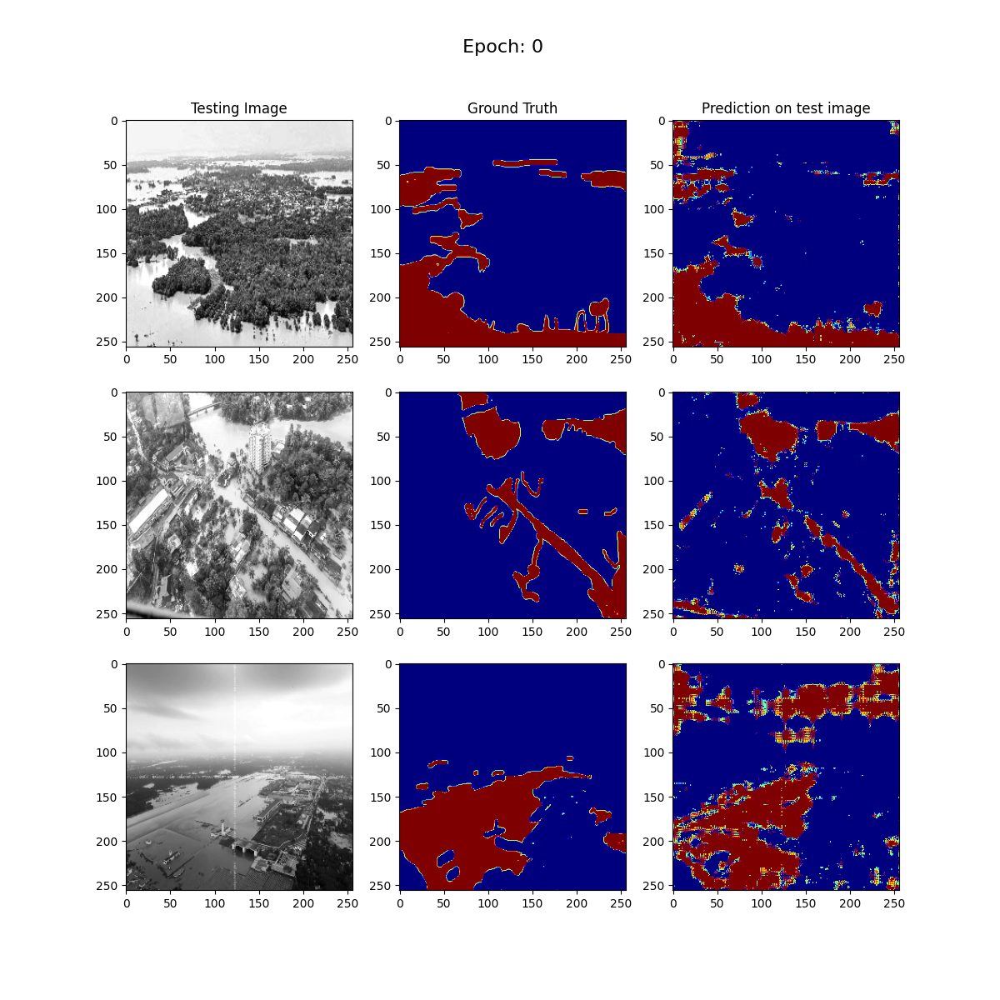
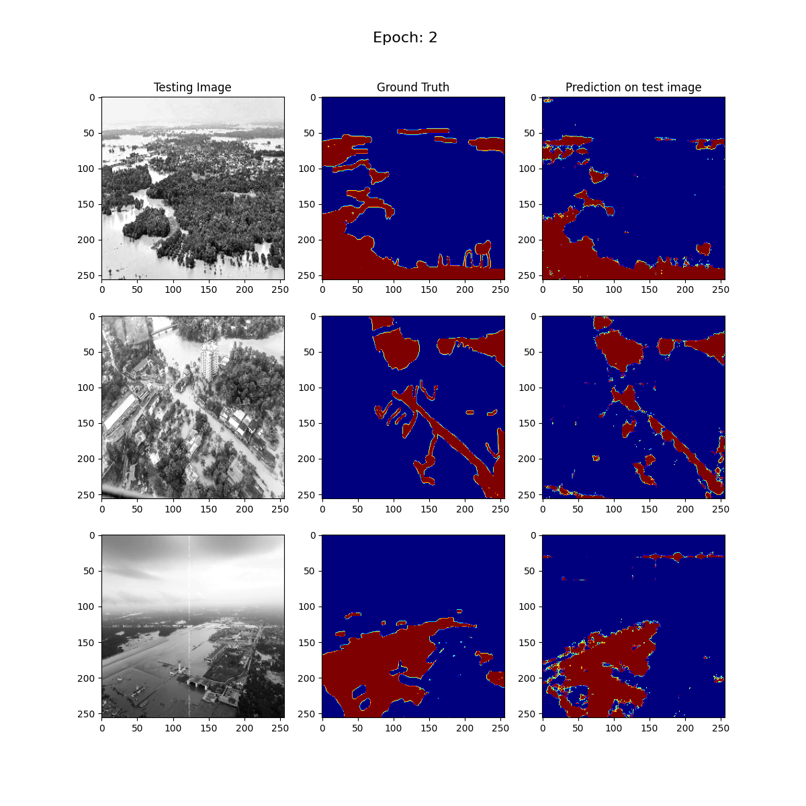
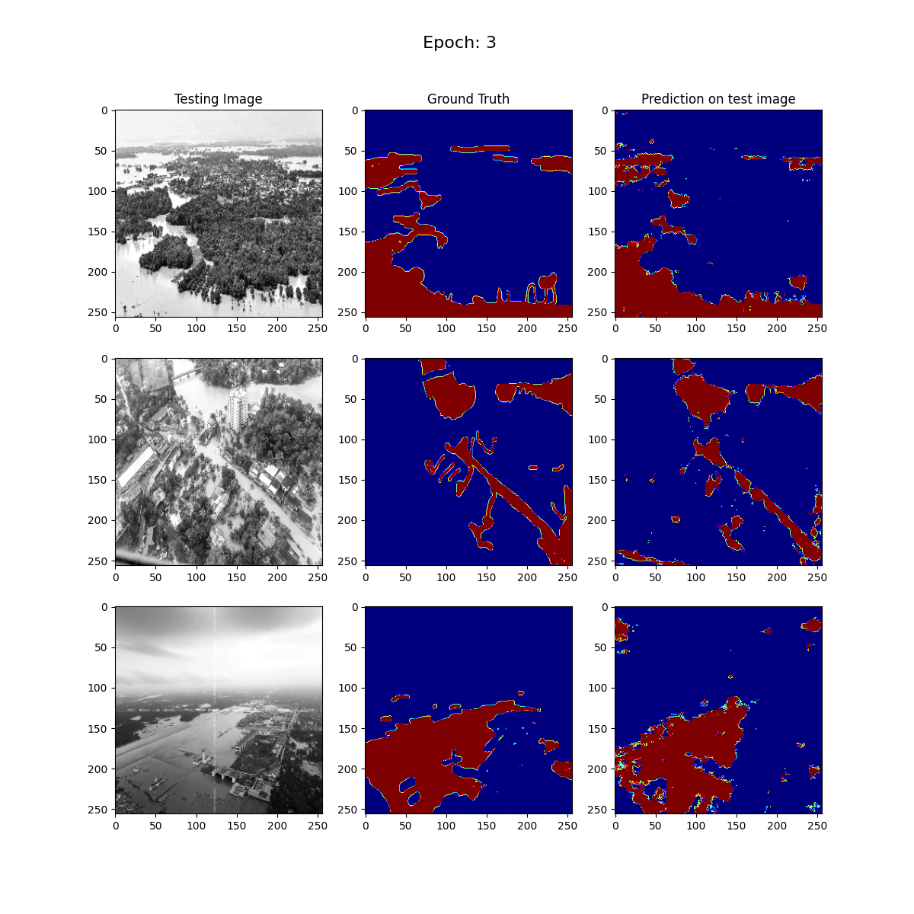
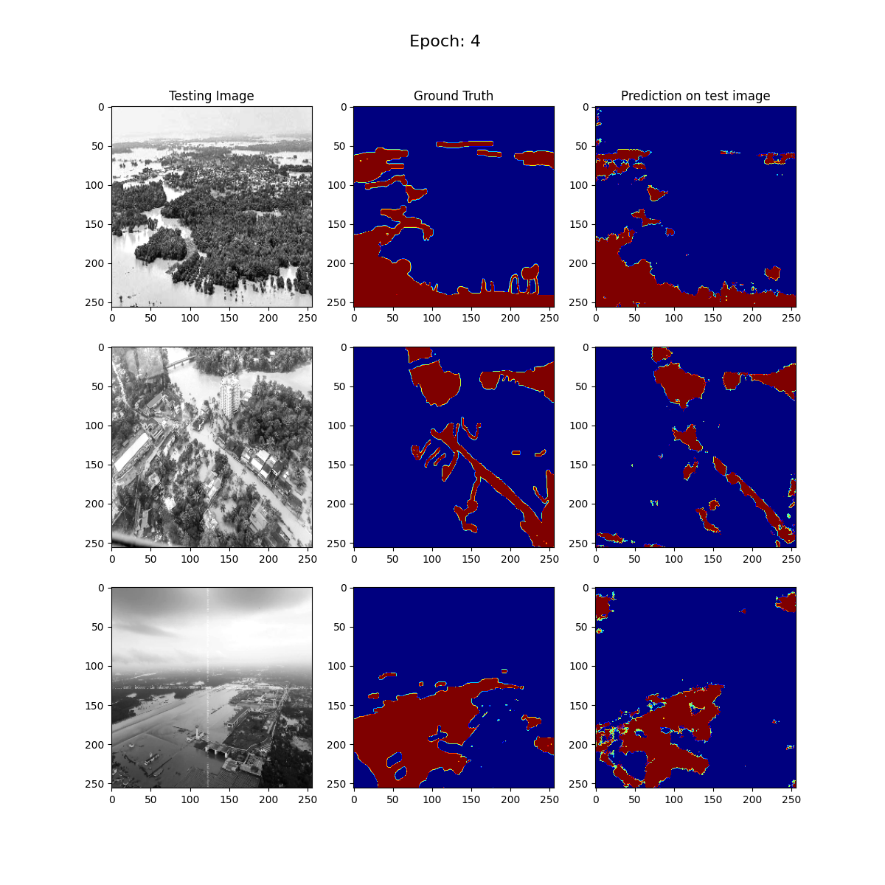
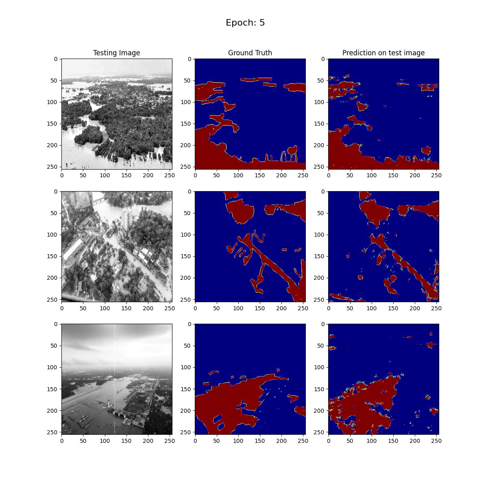
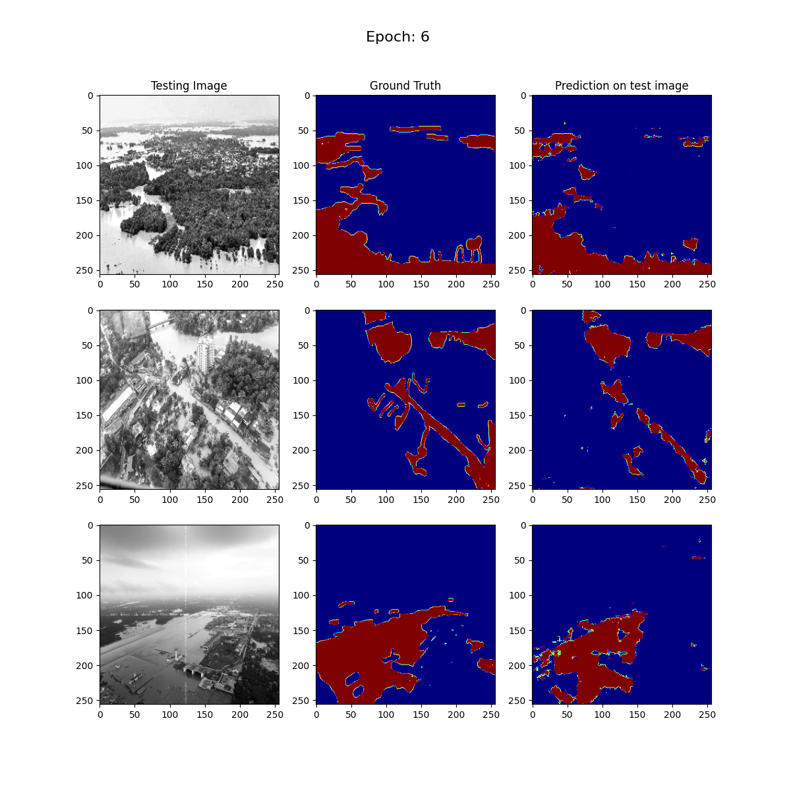
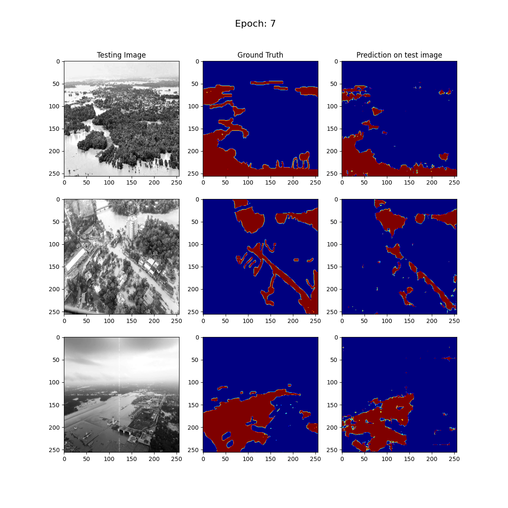
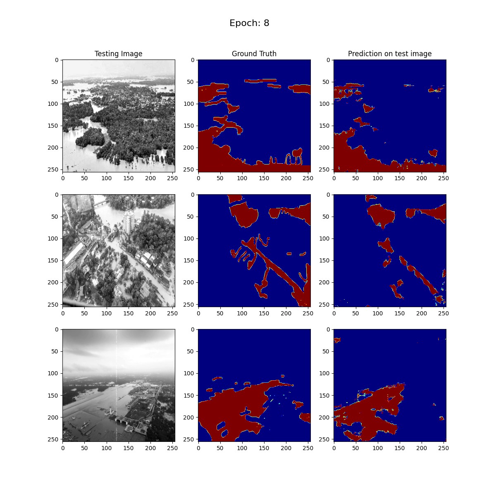
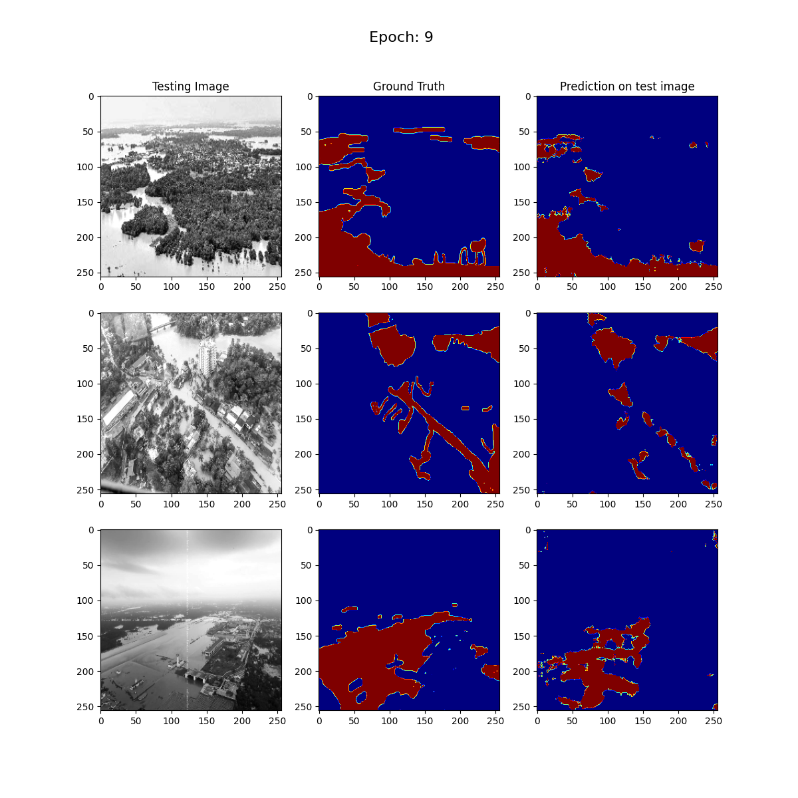

# Flood Area Segmentation using U-Net with MobileNetV2

This repository contains code for semantic segmentation of flood-hit areas using a U-Net architecture with MobileNetV2 as the base model. The objective is to segment the water region in images of flood-affected areas.

## Dataset

The dataset used is the [Flood Area Segmentation](https://www.kaggle.com/datasets/faizalkarim/flood-area-segmentation) from Kaggle. It consists of 290 images and their corresponding self-annotated mask images, which highlight the water regions. The masks were created using Label Studio, an open-source data labeling software.

### Dataset Description

- **Images**: 290 images of flood-hit areas.
- **Masks**: Self-annotated masks showing water regions.
- **Purpose**: To train a segmentation model that can identify flooded areas in images for better decision-making and planning during flood surveys.

## Model

### Architecture

The model used is a U-Net, a type of convolutional neural network that is effective for image segmentation tasks. The base model for the encoder is MobileNetV2.

### Hyperparameters

- **Epochs**: 10 (It is recommended to train with more epochs for better and higher accuracy)
- **Val_Subsplits**: 5
- **Batch_Size**: 25

## Usage

1. Clone the repository:
    ```bash
    git clone https://github.com/AlirezaHabibi1377/Flood-Area-Segmentation-using-U-Net-with-MobileNetV2.git
    ```

2. Download the dataset from [Kaggle](https://www.kaggle.com/datasets/faizalkarim/flood-area-segmentation) and place it in the appropriate directory.

3. Run the notebook script:
    ```bash
    DL_1_Semantic_Segmentation_Flood.ipynb
    ```
# Outputs (for just 3 random images)

- **epoch 1:**

- **epoch 2:**

- **epoch 3:**

- **epoch 4:**

- **epoch 5:**

- **epoch 6:**

- **epoch 7:**

- **epoch 8:**

- **epoch 9:**

- **epoch 10:**



## Conclusion

This project demonstrates how to use a U-Net with MobileNetV2 for semantic segmentation of flooded areas. The trained model can help in flood surveys and decision-making by accurately identifying water regions in images of flood-hit areas. Further training with more epochs and additional data augmentation techniques can improve the model's accuracy.
